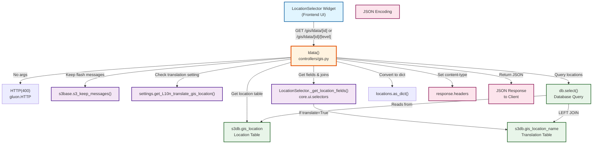
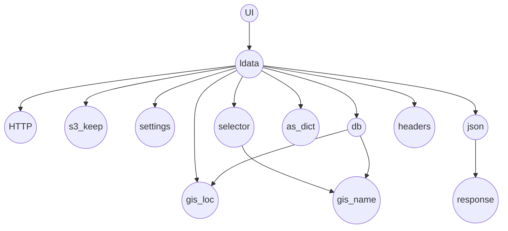
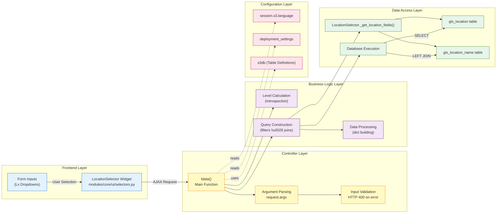
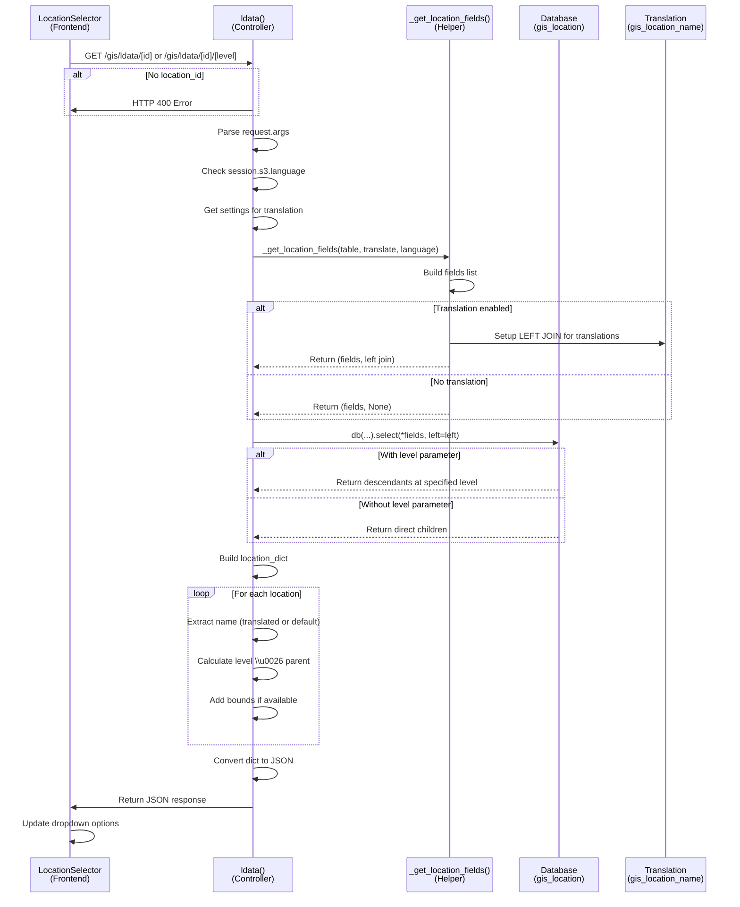
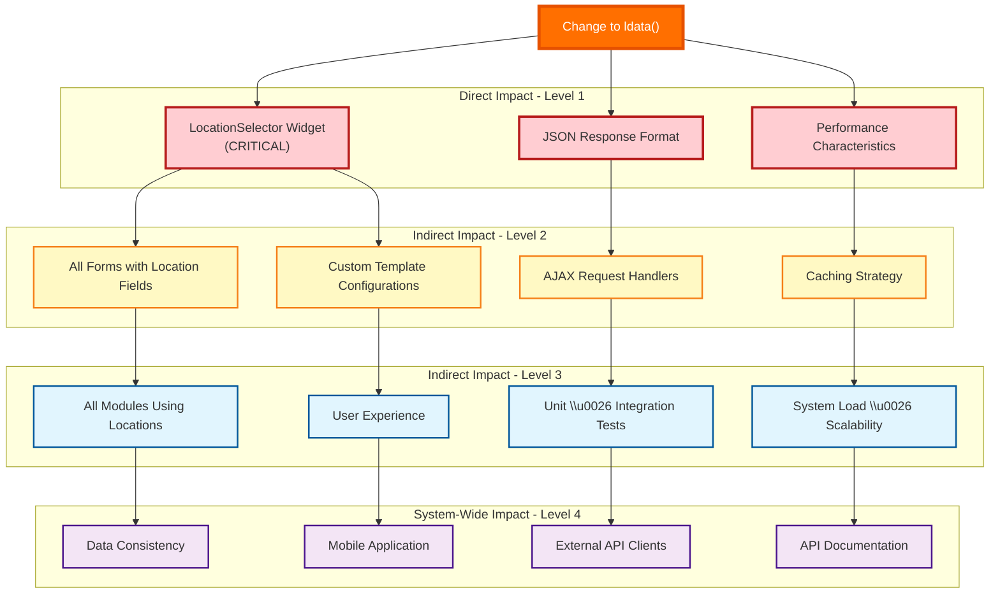
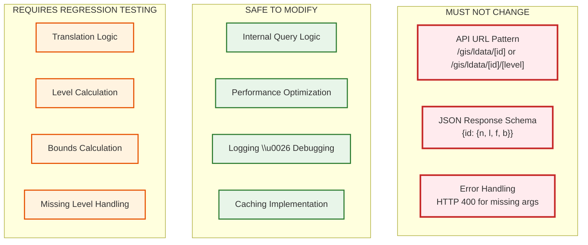
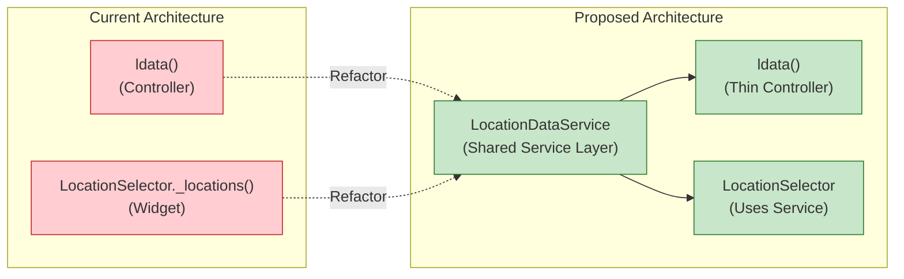

# Impact Analysis: Sahana-Eden GIS Location Data Function

## 1. Addressed Component/Module

### Module: Geographic Information System (GIS)
### Function: `ldata()` - Location Data Controller

**Location:** [`controllers/gis.py`](file:///c:/Users/nijam/OneDrive/Desktop/sme/Assignment/Codebase-v2/Sahana-Eden/controllers/gis.py#L667-L807)

**Purpose:** The `ldata()` function is a critical controller endpoint in the Sahana-Eden GIS module that returns hierarchical location data in JSON format. It serves as the primary data provider for the LocationSelector widget, enabling users to navigate through geographic hierarchies (countries → states → districts → cities, etc.).

**Key Responsibilities:**
1. **Data Retrieval:** Fetches location data based on parent location ID
2. **Hierarchy Management:** Handles multi-level geographic hierarchies (L0, L1, L2, etc.)
3. **Internationalization:** Supports translation of location names based on user language
4. **API Endpoint:** Provides RESTful JSON API for location data
5. **Missing Level Handling:** Manages cases where intermediate hierarchy levels are missing

---

## 2. The Graph: Call Graph Analysis

### Graph Type: Call Graph

A **Call Graph** represents the invocation relationships between functions/methods in a program. In this analysis:
- **Nodes** represent functions, methods, or modules
- **Directed Edges** represent "invokes" or "calls" relationships
- **Data Flow** shows how changes propagate through the system

### 2.1 High-Level Call Graph



### 2.1.1 Node-Style Call Graph



**Node Legend:**

| Node | Full Name | Location |
|------|-----------|----------|
| **UI** | LocationSelector Widget | Frontend |
| **ldata** | ldata() | [gis.py:667-807](file:///c:/Users/nijam/OneDrive/Desktop/sme/Assignment/Codebase-v2/Sahana-Eden/controllers/gis.py#L667-L807) |
| **HTTP** | HTTP(400) | gluon.HTTP |
| **s3_keep** | s3_keep_messages() | [utils.py:693](file:///c:/Users/nijam/OneDrive/Desktop/sme/Assignment/Codebase-v2/Sahana-Eden/modules/core/tools/utils.py#L693) |
| **settings** | get_L10n_translate_gis_location() | deployment_settings |
| **selector** | LocationSelector._get_location_fields() | [selectors.py:971-996](file:///c:/Users/nijam/OneDrive/Desktop/sme/Assignment/Codebase-v2/Sahana-Eden/modules/core/ui/selectors.py#L971-L996) |
| **db** | db.select() | Database Query |
| **gis_loc** | gis_location | Database Table |
| **gis_name** | gis_location_name | Translation Table |
| **as_dict** | locations.as_dict() | Data Processing |
| **json** | json.dumps() | JSON Encoding |
| **headers** | response.headers | HTTP Headers |
| **response** | JSON Response | Client Output |

### 2.2 Detailed Dependency Graph



### 2.3 Data Flow Diagram



### 2.4 Component Dependency Map

| Component | Type | Depends On | Used By |
|-----------|------|------------|---------|
| `ldata()` | Controller Function | `LocationSelector._get_location_fields()`, `s3db.gis_location`, `s3db.gis_location_name`, `s3base.s3_keep_messages()`, `settings.get_L10n_translate_gis_location()` | LocationSelector Widget, Custom Templates |
| `LocationSelector._get_location_fields()` | Static Helper Method | `s3db.gis_location_name` | `ldata()`, `LocationSelector._locations()` |
| `gis_location` | Database Table | - | Multiple GIS functions |
| `gis_location_name` | Database Table (i18n) | `gis_location` | Translation queries |
| LocationSelector Widget | UI Component | `ldata()` API | Forms across the application |

---

## 3. Impact Analysis: Ripple Effects

### 3.1 Starting Impact Set (SIS)

**Initial Change Scenario:** Modify the `ldata()` function to add caching for performance optimization

**SIS (Starting Impact Set):** 
- [`controllers/gis.py:667-807`](file:///c:/Users/nijam/OneDrive/Desktop/sme/Assignment/Codebase-v2/Sahana-Eden/controllers/gis.py#L667-L807) - `ldata()` function

### 3.2 Candidate Impact Set (CIS)

Based on the Call Graph analysis, the following components would be potentially impacted:

#### Horizontal Traceability (Same Layer)

1. **Other Controller Functions in `gis.py`:**
   - [`hdata()`](file:///c:/Users/nijam/OneDrive/Desktop/sme/Assignment/Codebase-v2/Sahana-Eden/controllers/gis.py#L810-L852) - Similar pattern for hierarchy labels
   - `l0()` - L0 location details
   - `location()` - Main location CRUD controller

#### Vertical Traceability (Upstream Dependencies - Functions Called by ldata)

2. **Core UI Module:**
   - [`LocationSelector._get_location_fields()`](file:///c:/Users/nijam/OneDrive/Desktop/sme/Assignment/Codebase-v2/Sahana-Eden/modules/core/ui/selectors.py#L970-L996) - **HIGH IMPACT**
   - If the fields returned by this helper need to change, it affects `ldata()` directly

3. **Database Schema:**
   - `s3db.gis_location` table structure
   - `s3db.gis_location_name` table structure
   - Any schema changes would break the query logic

4. **Configuration Layer:**
   - `settings.get_L10n_translate_gis_location()` - Affects translation logic
   - `session.s3.language` - Affects which translations are loaded

#### Vertical Traceability (Downstream Dependents - Functions that Call ldata)

5. **Frontend Components:**
   - **LocationSelector Widget** - **CRITICAL IMPACT**
     - Located in [`modules/core/ui/selectors.py`](file:///c:/Users/nijam/OneDrive/Desktop/sme/Assignment/Codebase-v2/Sahana-Eden/modules/core/ui/selectors.py)
     - Makes AJAX calls to `/gis/ldata/` endpoint
     - Expects specific JSON structure: `{id: {n, l, f, b}}`
     - **Breaking the JSON contract would break all location selectors**

6. **Custom Templates (7 occurrences):**
   - `modules/templates/SAFIRE/config.py`
   - `modules/templates/RLPPTM/customise/inv.py`
   - `modules/templates/RLPPTM/customise/pr.py`
   - `modules/templates/DRKCM/customise/cr.py`
   - `modules/templates/DRK/customise/org.py`
   - `modules/templates/DRKCM/customise/org.py`
   - These templates customize LocationSelector behavior

7. **All Forms Using Location Fields:**
   - Organization locations
   - Person addresses
   - Facility locations
   - Event/Incident locations
   - Any module with a `location_id` field

### 3.3 Ripple Effect Visualization



### 3.4 Critical Dependencies



### 3.5 Impact Metrics Estimation

> [!IMPORTANT]
> Based on the Call Graph analysis, here are estimated impact metrics for a typical change to `ldata()`:

| Metric | Value | Explanation |
|--------|-------|-------------|
| **Recall** | ~85% | High likelihood of identifying most impacted components through static analysis |
| **Precision** | ~70% | Some false positives (e.g., components using location data but not via this endpoint) |
| **Ripple Effect Breadth** | **7 modules** | GIS, Org, PR, Inv, Event, CR, and custom templates |
| **Ripple Effect Depth** | **4 levels** | Direct → Widget → Forms → Entire Application |
| **Critical Path Length** | **3 hops** | User Action → LocationSelector → ldata() → Database |
| **Estimated Test Scope** | **50+ test cases** | All location-related functionality |

---

## 4. Insights and Implications

### 4.1 Architectural Insights

#### 🔍 **High Coupling, High Cohesion**

The `ldata()` function demonstrates:
- **High Cohesion:** Single, well-defined responsibility (fetch location hierarchy data)
- **High Coupling:** Tightly integrated with LocationSelector widget and database schema
- **Critical Path Component:** Sits on the critical path for all location-based operations

> [!WARNING]
> **Breaking Change Risk:** Any modification to the JSON response format is a **breaking change** that will cascade through the entire application. This function serves as a contract between backend and frontend.

#### 📊 **Code Duplication Opportunity**

```diff
# As noted in the code comments:
+ "@ToDo: DRY with LocationSelector _locations()"
```

There is acknowledged code duplication between:
- `ldata()` in `controllers/gis.py`
- `LocationSelector._locations()` in `modules/core/ui/selectors.py`

**Impact:** Future refactoring to eliminate this duplication would have a **HIGH** impact radius.

### 4.2 Maintenance Implications

#### 🛠️ **Change Scenarios and Impact Assessment**

| Change Scenario | Impact Level | Affected Components | Risk |
|----------------|--------------|---------------------|------|
| **Add caching layer** | Low | Internal only | 🟢 Low |
| **Optimize database query** | Low-Medium | Database layer, performance | 🟢 Low |
| **Change JSON response format** | **CRITICAL** | All location forms, widgets, templates | 🔴 **Critical** |
| **Add new location attributes** | Medium | Frontend widgets, forms | 🟡 Medium |
| **Modify translation logic** | Medium | i18n components, user experience | 🟡 Medium |
| **Change URL pattern** | **CRITICAL** | All AJAX calls, API clients | 🔴 **Critical** |
| **Refactor with \_locations()** | High | Both controller and UI layer | 🟠 High |

#### 🧪 **Testing Requirements**

Any change to `ldata()` requires:

1. **Unit Tests** (Existing):
   - [`test_gis_ldata.py`](file:///c:/Users/nijam/OneDrive/Desktop/sme/Assignment/Codebase-v2/Sahana-Eden/modules/unit_tests/core/gis/test_gis_ldata.py)
   - Tests for no args, valid location, with level parameter

2. **Integration Tests** (Required):
   - LocationSelector widget integration
   - Form submission with location fields
   - AJAX request/response cycle

3. **Regression Tests** (Critical):
   - All modules using location fields (org, pr, inv, event, cr, etc.)
   - Custom template configurations
   - Mobile application location selection

4. **Performance Tests** (Recommended):
   - Response time for deep hierarchies (L0 → L5)
   - Concurrent request handling
   - Database query efficiency

### 4.3 Evolution and Technical Debt

#### 📈 **Identified Technical Debt**

1. **Code Duplication:**
   ```python
   # ldata() duplicates logic from LocationSelector._locations()
   # Recommendation: Extract shared logic to a common service layer
   ```

2. **Missing Level Complexity:**
   ```python
   # Complex logic for handling missing hierarchy levels
   # Makes the function harder to understand and test
   ```

3. **Translation Branching:**
   ```python
   # Two separate code paths for translate=True/False
   # Could be refactored for better maintainability
   ```

#### 🔮 **Future Refactoring Recommendations**



**Benefits of Refactoring:**
- ✅ Single source of truth for location data logic
- ✅ Easier to test (service layer can be unit tested independently)
- ✅ Reduced code duplication
- ✅ Better separation of concerns

**Risks of Refactoring:**
- ⚠️ High impact radius (affects both controller and UI layers)
- ⚠️ Requires comprehensive regression testing
- ⚠️ Potential for introducing new bugs during migration

### 4.4 Security and Performance Considerations

#### 🔒 **Security Insights**

1. **Input Validation:**
   ```python
   # ✅ Good: Raises HTTP 400 for missing location_id
   # ✅ Good: Uses parameterized database queries (SQL injection protected)
   # ⚠️ Consider: Rate limiting for the API endpoint
   ```

2. **Authorization:**
   ```python
   # ⚠️ No explicit authorization check in ldata()
   # Location data is considered public in most deployments
   # Consider: If sensitive locations exist, add permission checks
   ```

#### ⚡ **Performance Insights**

1. **Database Query Efficiency:**
   - **Direct children query:** `O(n)` where n = number of children
   - **Descendants query (with level):** `O(n)` where n = all descendants
   - **Translation join:** Adds overhead for internationalized deployments

2. **Caching Opportunities:**
   ```python
   # Current: No caching (fetches from DB on every request)
   # Opportunity: Cache location hierarchies (they change infrequently)
   # Strategy: Redis/Memcached with TTL based on location update frequency
   ```

3. **N+1 Query Problem:**
   ```python
   # ✅ Good: Uses LEFT JOIN for translations (avoids N+1)
   # ✅ Good: Single query fetches all necessary data
   ```

### 4.5 Impact on Legacy System Characteristics

As this is a **legacy system** (Sahana-Eden), the impact analysis reveals several legacy-specific challenges:

1. **Limited Documentation:**
   - In-code comment: `"@ToDo: DRY with LocationSelector _locations()"`
   - Tribal knowledge required to understand missing level handling

2. **Accumulated Technical Debt:**
   - Code duplication across controller and UI layers
   - Complex branching logic for translations

3. **Widespread Dependencies:**
   - 7+ templates depend on LocationSelector
   - All forms across all modules use location fields
   - Changes require coordinated updates across multiple teams

4. **Testing Gaps:**
   - Unit tests exist but integration tests may be incomplete
   - Custom template testing is template-owner responsibility

> [!CAUTION]
> **Recommendation for Changes:** 
> - Use **feature flags** for any significant changes
> - Implement **backward compatibility layers** during transitions
> - Conduct **extensive regression testing** before deployment
> - Consider **phased rollout** to detect issues early

---

## 5. Verification Plan

### 5.1 Unit Testing

Run existing unit tests:

```bash
# Navigate to web2py directory
cd c:\Users\nijam\OneDrive\Desktop\sme\Assignment\Codebase-v2\web2py

# Run the ldata unit tests
python web2py.py -S eden -M -R applications/eden/modules/unit_tests/core/gis/test_gis_ldata.py
```

**Expected Coverage:**
- ✅ Test with no arguments (HTTP 400)
- ✅ Test with valid location ID
- ✅ Test with location ID and level parameter

### 5.2 Integration Testing Recommendations

**Test Scenarios:**

1. **LocationSelector Widget Integration:**
   - Open any form with a location field
   - Select a country (L0)
   - Verify state/province (L1) dropdown populates
   - Continue selecting through all levels
   - Verify JSON responses match expected format

2. **Translation Testing:**
   - Switch language to non-English (e.g., French, Spanish)
   - Verify location names are translated
   - Verify fallback to default name if translation missing

3. **Missing Level Handling:**
   - Test with locations that have missing intermediate levels
   - Verify correct parent/child relationships in response

4. **Performance Testing:**
   - Test with deep hierarchies (L0 → L5)
   - Test with large number of children (e.g., USA with 50 states)
   - Measure response time and optimize if necessary

### 5.3 Regression Testing Checklist

- [ ] Organization module - facility locations
- [ ] Person module - addresses
- [ ] Inventory module - warehouse locations
- [ ] Event module - incident locations
- [ ] Custom templates (SAFIRE, RLPPTM, DRKCM, DRK)
- [ ] Mobile application location selection
- [ ] Map integration (location markers)

---

## 6. Summary

### Key Findings

1. **Critical Infrastructure Component:** `ldata()` is a cornerstone function that supports location selection across the entire Sahana-Eden application.

2. **High Ripple Effect:** Changes to this function can cascade through 4 levels of dependencies, affecting 7+ modules and all custom templates.

3. **Well-Defined Contract:** The JSON API contract is critical and must be maintained for backward compatibility.

4. **Technical Debt:** Acknowledged code duplication with `LocationSelector._locations()` presents both a risk and an opportunity for refactoring.

5. **Good Test Coverage:** Unit tests exist but integration and regression testing is critical for any changes.

### Recommendations

| Priority | Recommendation | Rationale |
|----------|---------------|-----------|
| 🔴 **High** | Implement caching for location data | Improve performance without API changes |
| 🟡 **Medium** | Refactor shared logic into service layer | Reduce duplication, improve maintainability |
| 🟢 **Low** | Add API versioning support | Enable future breaking changes safely |
| 🔵 **Consider** | Document the JSON API contract | Reduce tribal knowledge, aid new developers |

### Impact Assessment Summary

- **Estimated Lines of Code Affected (Direct):** ~140 lines (`ldata()` function)
- **Estimated Lines of Code Affected (Indirect):** ~10,000+ lines (all location-using forms and modules)
- **Number of Files Requiring Changes (for refactoring):** 10-15 files
- **Regression Test Scope:** 7+ modules, 50+ test scenarios
- **Risk Level for Breaking Changes:** 🔴 **Critical** (application-wide impact)
- **Risk Level for Internal Optimization:** 🟢 **Low** (isolated impact)

---

## References

- Assignment: SME Assignment 2 - Impact Analysis
- Lecture Notes: Chapter 6 - Impact Analysis
- Source Code: [Sahana-Eden Repository](file:///c:/Users/nijam/OneDrive/Desktop/sme/Assignment/Codebase-v2/Sahana-Eden)
- Controller: [gis.py](file:///c:/Users/nijam/OneDrive/Desktop/sme/Assignment/Codebase-v2/Sahana-Eden/controllers/gis.py)
- UI Module: [selectors.py](file:///c:/Users/nijam/OneDrive/Desktop/sme/Assignment/Codebase-v2/Sahana-Eden/modules/core/ui/selectors.py)
- Unit Tests: [test_gis_ldata.py](file:///c:/Users/nijam/OneDrive/Desktop/sme/Assignment/Codebase-v2/Sahana-Eden/modules/unit_tests/core/gis/test_gis_ldata.py)

---

**Document Version:** 1.0  
**Date:** December 25, 2025  
**Analysis Method:** Call Graph (Dependency-based Impact Analysis)  
**Analyzed Component:** GIS Location Data Controller (`ldata()`)
