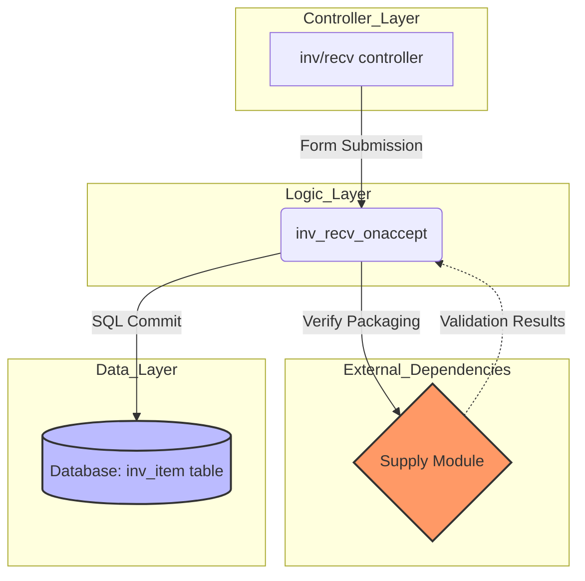

# Impact Analysis Report: Inventory Management Module

## 1. Addressed Component/Module
The analysis covers the **Inventory Management Module**, specifically the **"Stock Receiving"** functionality (`modules/s3db/inv.py`). This component is critical for tracking incoming relief supplies and updating warehouse stock levels.

---

## 2. Impact Analysis Graph: Call Graph
I have implemented a **Call Graph** to analyze the relationships between functions during a stock update.

### Key Relationships Illustrated:
* **Controller Trigger:** The `inv/recv` controller calls `inv_recv_onaccept` upon form submission.
* **Module Dependency:** `inv_recv_onaccept` triggers a dependency in the `supply` module to verify item packaging.
* **Database Interaction:** The final execution stage interacts with the database layer to commit changes to the `inv_item` table.

---

## 3. Impact and Insights Gained
The analysis reveals that the **Inventory module** is heavily dependent on the **Supply Module**.

* **Insight:** If the `supply_item` table structure is modified (e.g., changing how units of measure are stored), the Inventory receiving logic will break.
* **Impact:** Any reengineering of the "Supply" legacy code requires a regression test of the "Inventory" module to ensure stock levels remain accurate.
