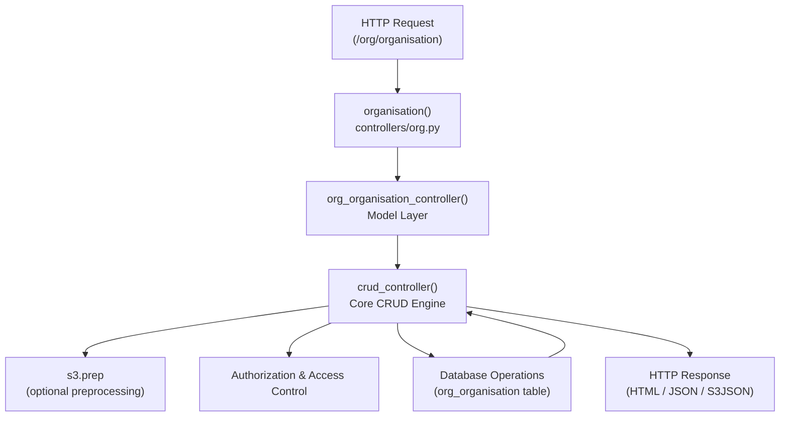

# Impact Analysis: Organisation REST Controller

## 1. Addressed Component / Module

### Module: Organisation Registry  
### Function: `organisation()` – RESTful CRUD Controller  

**Location:** `controllers/org.py`

**Description:**  
The `organisation()` function is a RESTful CRUD controller entry point for managing organisation records in the Sahana-Eden system. It delegates request handling to the organisation controller defined in the model layer and serves as the main access point for organisation-related create, read, update, and delete operations.

```python
def organisation():
    """ RESTful CRUD controller """

    # Defined in the Model for use from Multiple Controllers for unified menus
    return s3db.org_organisation_controller()
```
## 2. Selected Graph: Call Graph

### Graph Type: Call Graph

A **Call Graph** illustrates invocation relationships between functions.

- **Nodes** represent controller or helper functions  
- **Directed edges** represent function calls  
- The graph helps identify **direct and indirect impact propagation** caused by changes to the `organisation()` controller.


## 3. Call Graph for organisation()


## 4. Impact Analysis

### 4.1 Starting Impact Set (SIS)

**SIS:**

- `organisation()` in `controllers/org.py`

This function is the initial entry point affected by any change request related to organisation CRUD operations.

---

### 4.2 Candidate Impact Set (CIS)

Based on the call graph, a change to `organisation()` may impact the following components:

**Direct Impacts**

- `s3db.org_organisation_controller()`  
- Core `crud_controller()` logic  

**Indirect Impacts**

- Authorization and permission checks  
- Pre-processing hooks (`s3.prep`)  
- Database interactions with `org_organisation` table  
- Output representations (HTML, JSON, s3json)  

**Downstream Usage**

- Organisation management UI  
- Organisation selectors used in other modules  
- APIs consuming organisation data  

---

## 5. Impact Insights

- The `organisation()` function follows a **thin controller** design pattern, delegating most logic to the model layer.  
- Although structurally simple, it lies on a **critical execution path** for organisation management across the system.  
- Changes to the delegation logic or response handling may cause **ripple effects** across multiple modules that depend on organisation data.  

---

## 6. Summary

This call graph–based impact analysis shows that while `organisation()` itself contains minimal logic, it functions as a gateway controller with system-wide influence. Understanding its dependencies is essential to prevent unintended ripple effects when maintaining or evolving the legacy system.

---

**Analysis Method:** Dependency-based Impact Analysis (Call Graph)  
**Course Reference:** Chapter 6 – Impact Analysis  
**Component Analyzed:** `organisation()` RESTful CRUD controller


