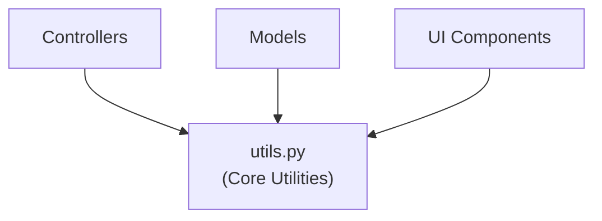

# Impact Analysis: Sahana-Eden Core Utilities Module

---

## 1. Addressed Component / Module

### Module: Core Utilities  
### File: `modules/core/tools/utils.py`

**Functions / Components Analyzed:**
- `get_form_record_data()`
- `s3_mark_required()`
- `FormKey` (utility helper class)

**Purpose:**  
The `utils.py` module provides shared utility functions that are reused across multiple controllers, models, and UI components in the Sahana-Eden system. These utilities encapsulate common helper logic related to form data handling, field configuration, and reusable abstractions, helping to reduce code duplication across the system.

Unlike controller modules, `utils.py` does not directly expose API endpoints or implement business workflows. Instead, it acts as a **supporting infrastructure layer** that enables consistent behavior and improves maintainability across higher-level modules.

**Key Responsibilities:**
1. **Form Data Processing:** Extracts and normalizes form record data for reuse  
2. **Field Configuration:** Applies required-field markings consistently across forms  
3. **Reusable Helper Logic:** Provides lightweight helper abstractions used by multiple modules  
4. **Maintainability Support:** Centralizes shared logic to reduce duplication and improve clarity  

---

## 2. The Graph: Call Graph Analysis

### Graph Type: Call Graph

A **Call Graph** represents invocation relationships between functions and modules.  
For utility modules, call graphs are particularly useful for identifying **horizontal impact propagation**, as utility functions are typically reused by many unrelated components.

In this analysis:
- **Nodes** represent utility functions and their callers  
- **Directed edges** represent function calls  
- **Impact propagation** occurs mainly through reuse rather than deep execution chains  

---

## 2.1 High-Level Call Graph

## 2.2 Component Dependency Map

| Component | Type | Depends On | Used By |
|----------|------|------------|---------|
| `get_form_record_data()` | Utility Function | Form objects, request variables | Controllers, Models |
| `s3_mark_required()` | Utility Function | Field definitions | Controllers, UI Forms |
| `FormKey` | Helper Class | Internal utility logic | Controllers, Models |
| `utils.py` | Core Utility Module | None (self-contained) | Multiple application modules |

---

## 3. Impact Analysis: Ripple Effects

### 3.1 Starting Impact Set (SIS)

**Initial Change Scenario:**  
Improve documentation, comments, and code readability of selected utility functions without modifying functional behavior.

**SIS (Starting Impact Set):**
- `modules/core/tools/utils.py`
- `get_form_record_data()`
- `s3_mark_required()`
- `FormKey`

---

### 3.2 Candidate Impact Set (CIS)

Based on the Call Graph analysis, the following components may be affected by changes to `utils.py`:

#### Horizontal Traceability (Same Layer)
- Other utility functions within `utils.py`
- Developers maintaining or extending shared helper logic

#### Vertical Traceability (Downstream Dependents)

**Controllers**
- Use utility functions for form processing and field configuration

**Models**
- Reuse form data extraction helpers

**UI Components**
- Depend on consistent required-field behavior

#### Explicitly Excluded Impacts
- No impact on database schema  
- No impact on REST APIs or JSON contracts  
- No impact on external clients or system configuration  

---

## 4. Impact Characteristics and Risk Assessment

### 4.1 Impact Characteristics

- **High Reuse:** Utility functions are reused across many unrelated modules  
- **Low Coupling:** Functions are stateless and do not implement business rules  
- **Shallow Ripple Depth:** Impact does not propagate beyond immediate callers  

### 4.2 Risk Assessment

| Change Type | Impact Level | Risk |
|------------|------------|------|
| Documentation updates | Minimal | 🟢 Low |
| Comment clarification | Minimal | 🟢 Low |
| Readability refactoring | Minimal | 🟢 Low |
| Functional logic change | Broad | 🔴 High |

Because the reengineering effort focuses solely on documentation and readability, the operational risk remains minimal.

---

## 5. Maintenance and Evolution Implications

### 5.1 Maintainability Improvements
- Improved clarity of function purpose and parameters  
- Reduced reliance on implicit or undocumented behavior  
- Easier onboarding for new developers  

### 5.2 Technical Debt Considerations
- Previously implicit logic is now explicitly documented  
- No new technical debt introduced  
- Improves long-term maintainability without architectural risk  

---

## 6. Verification Plan

### 6.1 Verification Strategy
As no functional behavior was modified, verification focuses on regression confidence:

- Existing unit and integration tests indirectly validate unchanged behavior  
- Manual inspection confirms logic equivalence before and after reengineering  

### 6.2 Regression Risk
- No regression expected  
- No additional test cases required  

---

## 7. Summary

### Key Findings
- The `utils.py` module is a widely reused but low-risk component  
- Impact propagation is horizontal rather than deep  
- Documentation-focused reengineering improves maintainability without affecting runtime behavior  

### Impact Assessment Summary
- **Direct Code Impact:** Limited to documentation and comments  
- **Indirect Impact:** Improved developer understanding across modules  
- **Risk Level:** 🟢 Low

